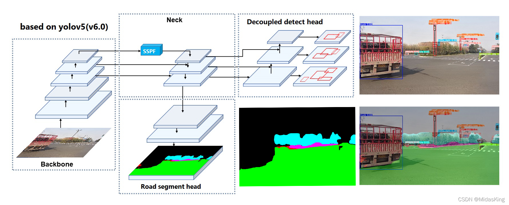
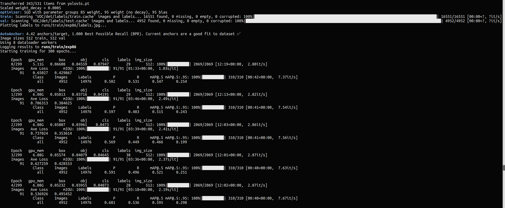
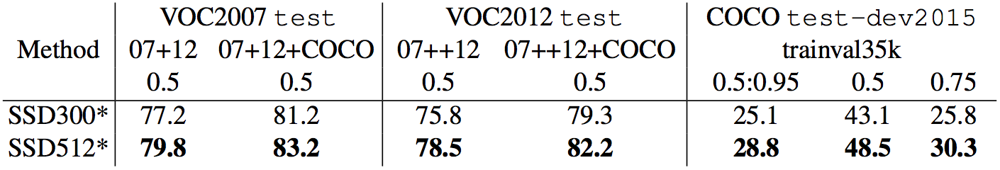
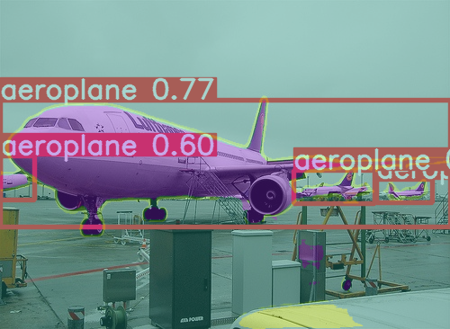
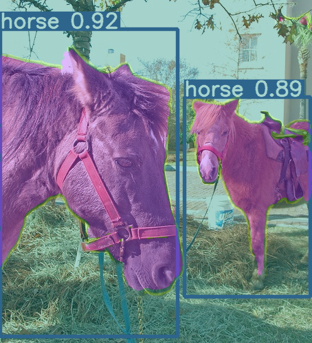
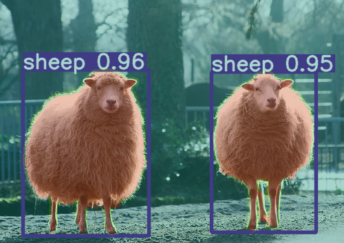

# YOLODS

基于[yolov5](https://github.com/ultralytics/yolov5)最新v6.0分支修改的多任务网络,可同时进行目标检测和分割.

<p align="center">

</p>Multi-task yolov5 with detection and segmentation

- [x] decoupled head
- [ ] anchor free
- [x] segmentation head

## Ablation experiment

在一个3k+训练1.5k+验证的47类数据集上实验:

| model                                          | P     | R     | map@.5 | map@.5:95 |
| ---------------------------------------------- | ----- | ----- | ------ | --------- |
| yolov5s                                        | 0.536 | 0.368 | 0.374  | 0.206     |
| yolov5s+train scrach                           | 0.452 | 0.314 | 0.306  | 0.152     |
| yolov5s+decoupled head                         | 0.555 | 0.375 | 0.387  | 0.214     |
| yolov5s + decoupled head+class balance weights | 0.541 | 0.392 | 0.396  | 0.217     |
| yolov5s + decoupled head+class balance weights | 0.574 | 0.386 | 0.403  | 0.22      |
| yolov5s + decoupled head+seghead               | 0.533 | 0.383 | 0.396  | 0.212     |

baseline模型为yolov5s.解耦头,类别权重等都可以提升MAP,添加分割头对检测效果影响甚微.

## Training Method

```
python trainds.py
```

<p align="center">

</p>

因为VOC数据集并没有同时提供所有的检测和分割标注，改为一个batch的检测和一个batch的分割数据集迭代训练,也即是训练时,一个batch检测和分割数据进行bp,然后梯度累积,然后统一进行更新参数.

## MAP

这里为了和SSD512对比,采用yolov5s模型,输入为512:

<p align="center">

</p>

| model                | VOC2007 test |
| -------------------- | ------------ |
| SSD512               | 79.8         |
| yolov5s+seghead(512) | 79.2         |

## demo

see detectds.py. VOC上权重见[weights](https://github.com/midasklr/yolov5ds/releases/download/v6.0/yolodsvoc.pt):

<p align="center">

</p>

<p align="center">

</p>

<p align="center">

</p>


## Train custom data

1. 使用labelme等工具标注检测框和分割mask;

   对于voc格式的box标注，可以使用 voc2yolo.py转为yolo格式；

   分割标注文件是json文件的话，需要转为类似VOC2012分割标签那种png格式。

2. 默认已经熟悉如何训练yolov5，否则参考 [how to arrange your detection dataset with yolov5](https://github.com/ultralytics/yolov5/wiki/Train-Custom-Data) , 对于训练自己的数据集，可以参考VOC数据的训练data/voc.yaml:

   ```
   # Train/val/test sets as 1) dir: path/to/imgs, 2) file: path/to/imgs.txt, or 3) list: [path/to/imgs1, path/to/imgs2, ..]
   path: .  # dataset root dir
   train: VOC/det/images/train  # train images (relative to 'path') 118287 images
   val: VOC/det/images/test  # train images (relative to 'path') 5000 images
   road_seg_train: VOC/seg/images/train   # road segmentation data
   road_seg_val: VOC/seg/images/val
   
   # Classes
   nc: 20  # number of classes
   segnc: 20
   
   names: ['aeroplane', 'bicycle', 'bird', 'boat',
              'bottle', 'bus', 'car', 'cat', 'chair',
              'cow', 'diningtable', 'dog', 'horse',
              'motorbike', 'person', 'pottedplant',
              'sheep', 'sofa', 'train', 'tvmonitor']  # class names
   
   segnames: ['aeroplane', 'bicycle', 'bird', 'boat',
              'bottle', 'bus', 'car', 'cat', 'chair',
              'cow', 'diningtable', 'dog', 'horse',
              'motorbike', 'person', 'pottedplant',
              'sheep', 'sofa', 'train', 'tvmonitor']
   ```

   3. 修改trainds.py 中的参数：

   ```
   python trainds.py 
   ```

   4. 如下测试图片文件夹：

      ```
      python detectds.py
      ```

      

## Blog

1. https://blog.csdn.net/IEEE_FELLOW/article/details/121912670
2. https://blog.csdn.net/qq_57076285/article/details/124265887
3. https://blog.csdn.net/sadjhaksdas/article/details/125762260

## Reference

1. [YOLOP: You Only Look Once for Panoptic Driving Perception](https://arxiv.org/abs/2108.11250)
2. [yolov5]( https://github.com/ultralytics/yolov5)
